# Project Name ->  forlorn-cause-7661

 

##  Contributors 

 Santosh Yadav.
 
 Swarup Kadoli.
 
 Abhishek Chatterjee.
 
 Pranay Jadhao.
 
 Mohammad Sahil.
 
##  Steps to follow
- `git clone` 
- `npm i`

# Project Project Name 

Hello everyone, this is a Readme for our construct week project that has been completed successfully within the duration of 5 days. It was really greate experience for us. Below  described the Features of our project.

 

### Deployed Links:
- https://wearly.vercel.app/

### Backend Links:
- Deployment :
- https://long-boa-sun-hat.cyclic.app
- Repository :
- https://github.com/swarup-1/asos-backend
- Repository for Login and SignUP :
- https://github.com/abhishek1337chatterjee/asos-login-signup-backend
 
 

## Project Details:

We got a task to make a functional clone website of `https://www.asos.com/`. ASOS Plc (ASOS) is a fashion online retailer that offers lifestyle products. The website
can be used to discover the latest fashion trends with ASOS. Shop the new collection of clothing, footwear, accessories, beauty products and more. we tried our best to clone the website from scratch based on the knowledge gained till unit-6 of Journey at Masai School.

- Original LOGO :

    

- Our LOGO :

   
 

## Tech-Stack:

- React.js
- React Routing
- React Redux
- React Redux Thunk
- CSS
- HTML
- Chakra UI Library
- Firebase

Glimpse and Screenshots of our cloned website:

## Navbar:

- This is the landing page of our website. Clicking an option on the Navbar will redirect to the respective page.

## Home Page:

- The images on the home page are linked to all Pages. Hence clicking on it will ensure successful redirection to the next Page.

- 
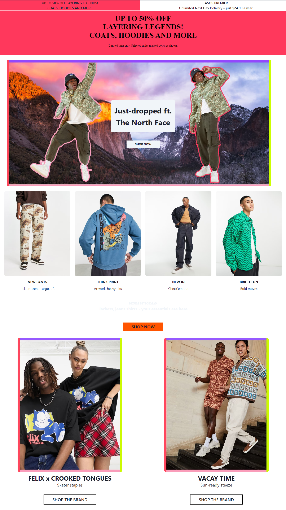

- 

## Footer bar:
- Here we have functions such as Indiamart official social media link, contacts, policies, and information. account, and address.

- 
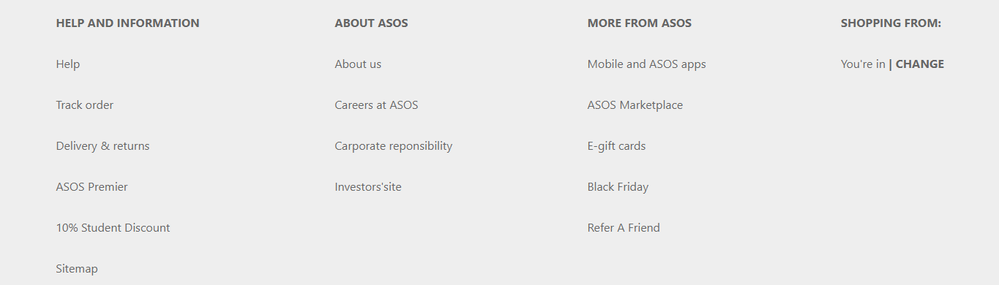

## Signup:

- Here we have a Modal Function on any page when users click on signup they get a popup on the screen  .
- User can Create account ny filling Signup Form
- 
 

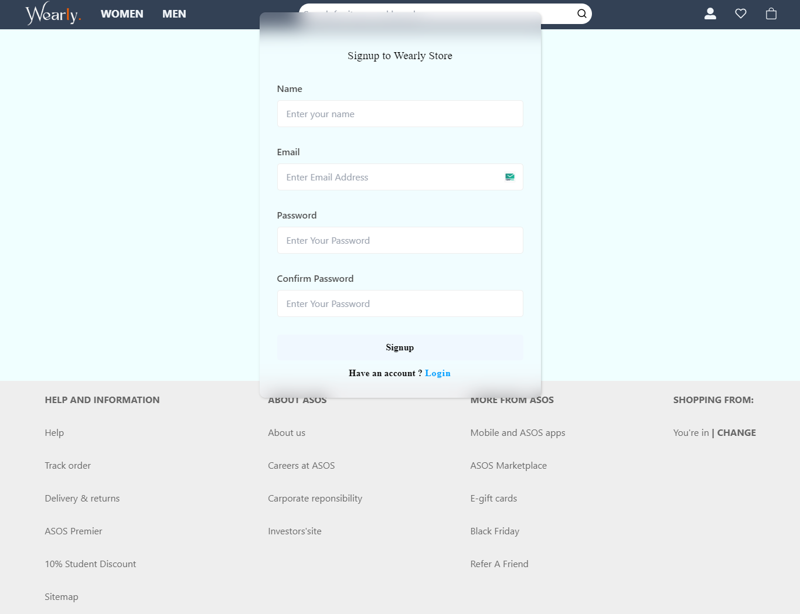

## Login page:

- Here we have a Modal Function on any page when users click on Login they get a popup on the screen. If the user is registered with the website, only then he/she can log in with their respective email id & password.
- User can Login with regestered email ID
- 
 
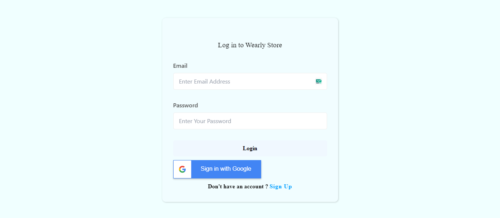

## Product Page:

- Mens Page :

   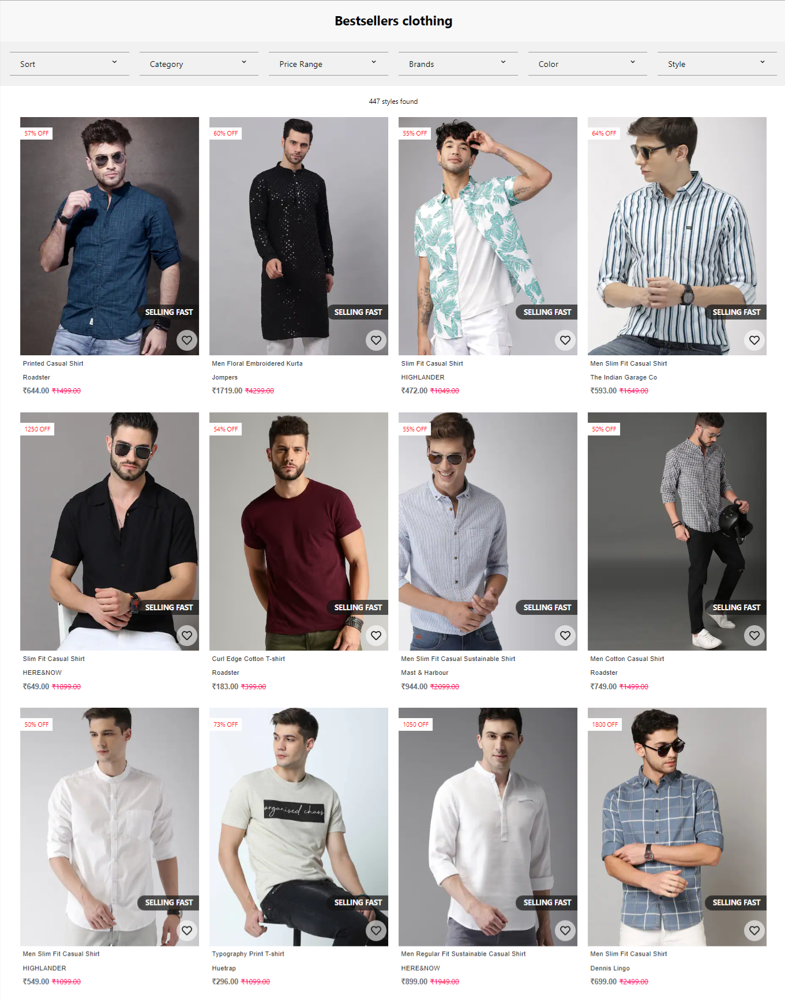

- Womens Page :

   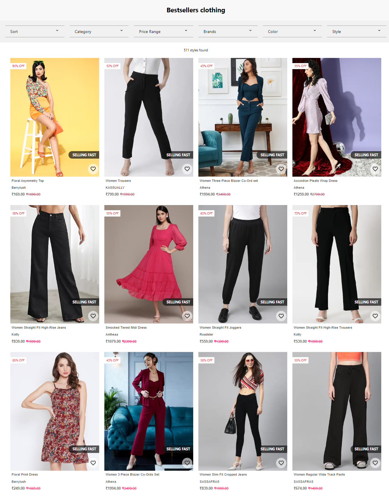
 

## Product Detailes Page:

   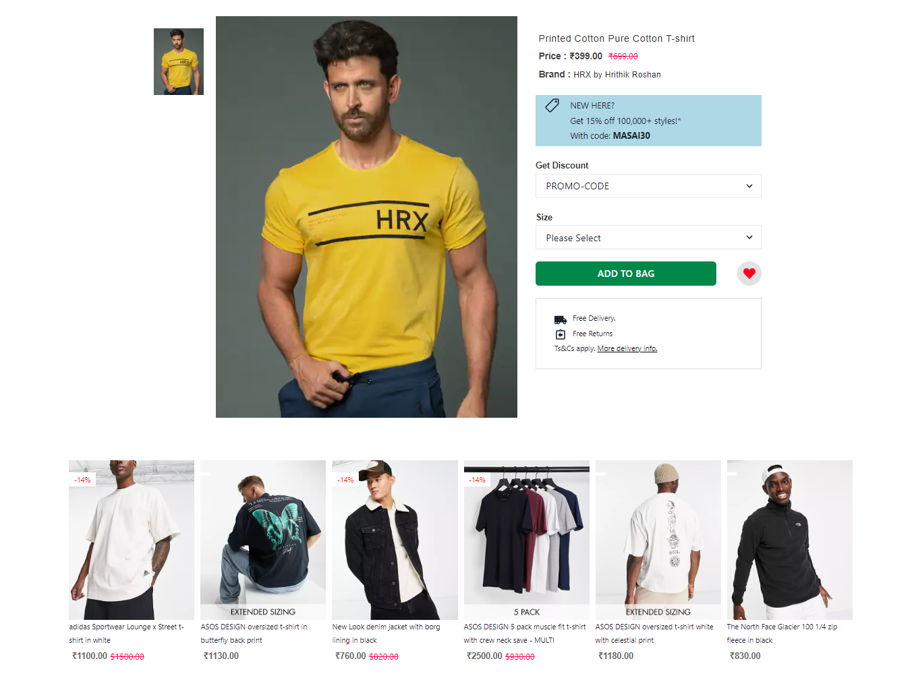

   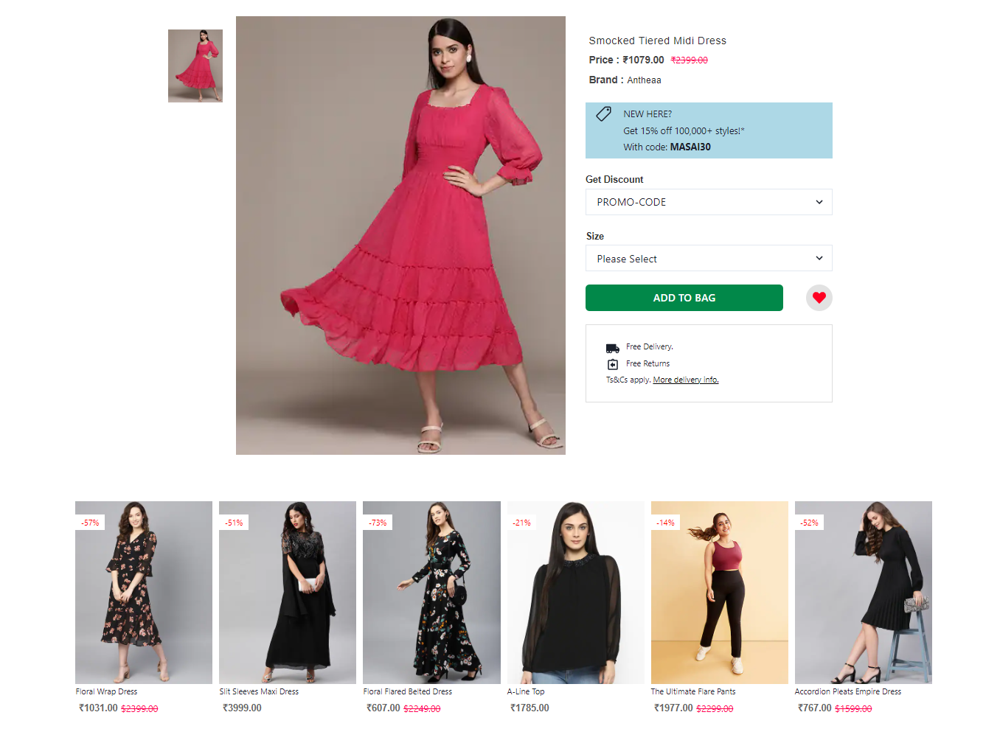
 

## Cart Page:

   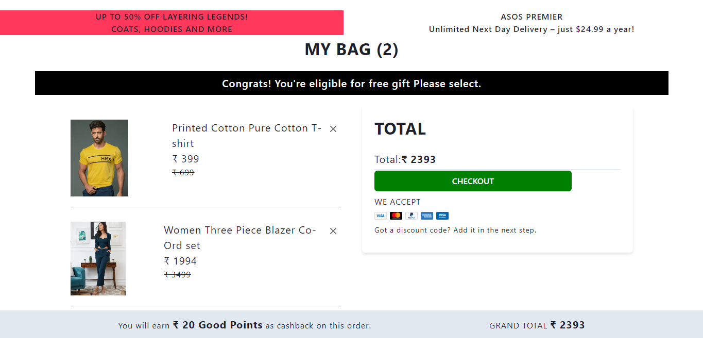

## Checkout Page:

   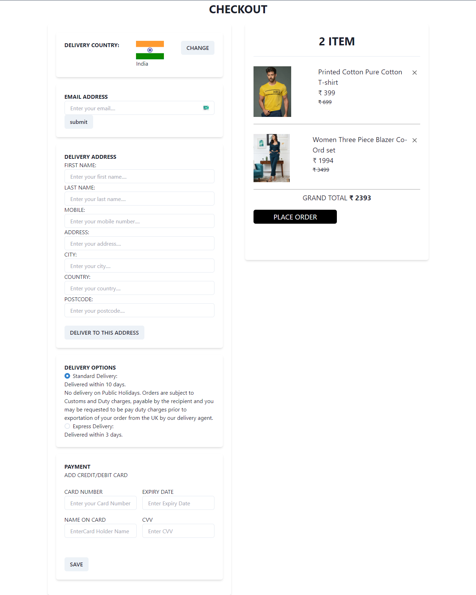
 

## Admin:

- 

- 
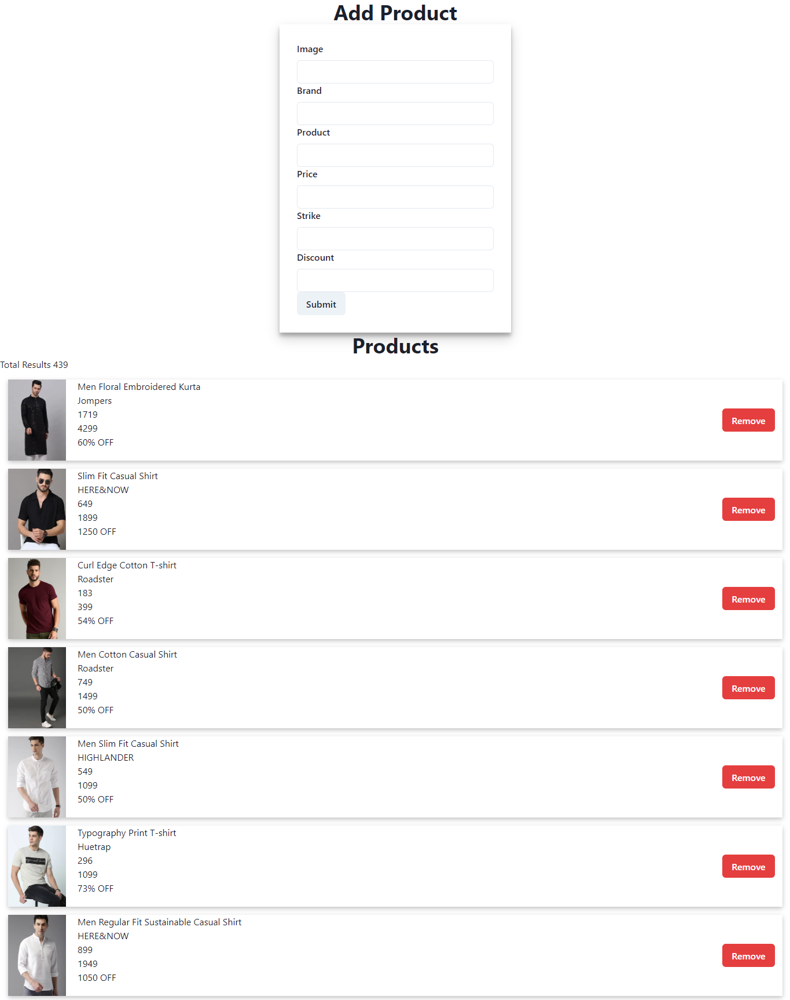

- Technically Help is the last page developed for the best User Interface UI smooth Operations.
